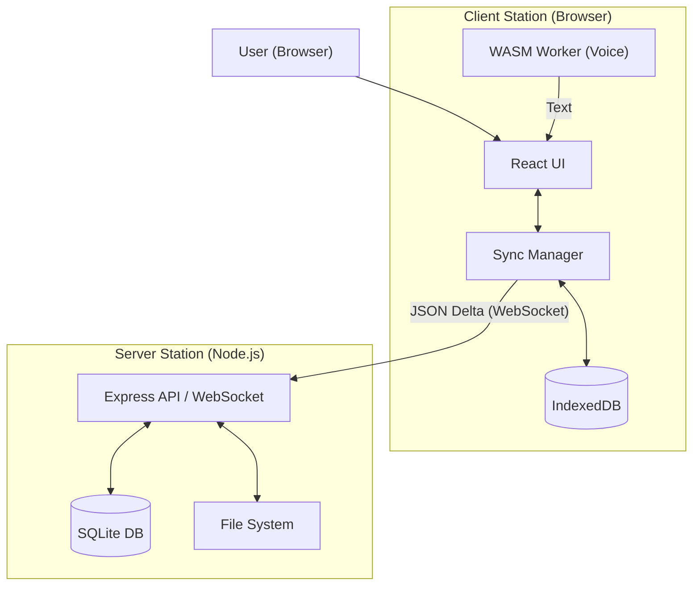
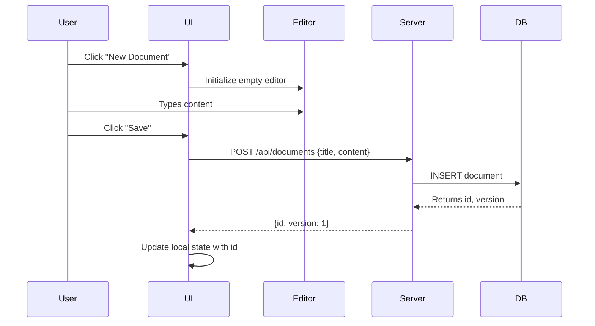
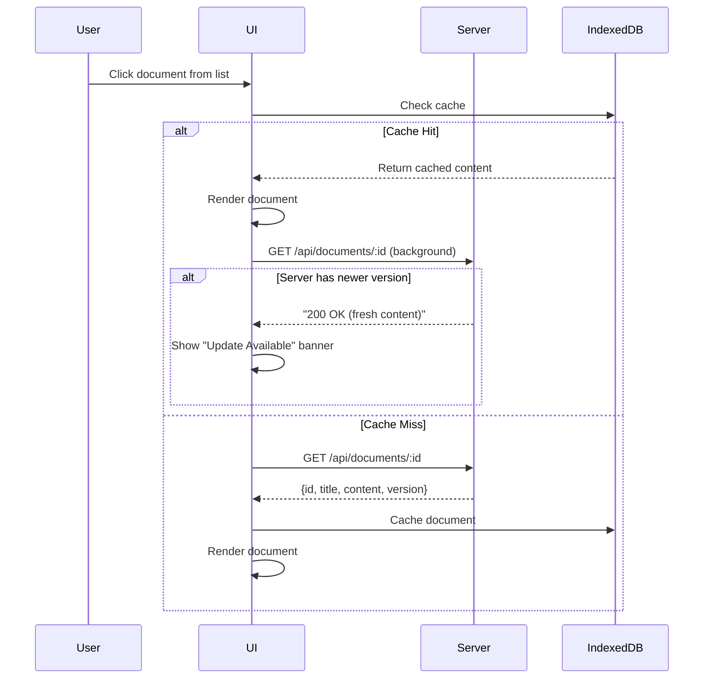
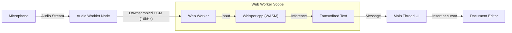

# Part 1 – Design & Approach (Smart Office) - v2.2

## 1. System Architecture & Design

To satisfy the requirements of an **offline-first**, **LAN-only**, **browser-based** document system, we need a robust architecture that handles brief network partitions and concurrent edits gracefully, even without a cloud connection.

### 1.1 High-Level Architecture

We will use a **Client-Server-Controller** pattern optimized for LAN environments.



### 1.2 Communication Protocol

* **Primary**: **WebSockets** (Socket.io). We need full-duplex communication for presence, locks, and quick updates.
* **Fallback**: Standard REST API.

### 1.3 Data Schema (Simplified)

**Docs Table**:

```sql
CREATE TABLE documents (
  id TEXT PRIMARY KEY,
  title TEXT,
  content BLOB, -- Stored as JSON Delta
  version INTEGER, -- For Optimistic Concurrency Control
  last_modified_by TEXT,
  is_template BOOLEAN DEFAULT 0,
  locked_by TEXT DEFAULT NULL, -- Simple mutex for v1
  created_at DATETIME
);
```

## 2. Document Editing & Synchronization (The Hard Part)

### 2.1 Formatting Requirements (Explicit Schema & Commands)

* **Choice**: **Quill.js** (with React-Quill wrapper).
* **Reasoning**: Quill provides a clean API, outputs deterministic JSON (Delta format), and has built-in support for all required formatting features.

#### Concrete Formatting Implementation

The problem statement specifically requires:

**1. Bold, Headings, Lists**

* **Bold**: Quill toolbar button applies `{"bold": true}` attribute
* **Headings**: Dropdown for H1-H6, stored as `{"header": 1}` through `{"header": 6}`
* **Lists**: Ordered/unordered lists via `{"list": "ordered"}` or `{"list": "bullet"}`

**2. Tables**

* Quill doesn't support tables natively, so we will use the `quill-better-table` module.
* Alternative: Create a custom Blot (Quill's block extension system) for tables

**3. Sender's Address Alignment (Right-to-Left positioning)**

* Create a custom formatting button "Align Right"
* Implementation: `{"align": "right"}` attribute in Delta
* CSS: `.ql-align-right { text-align: right; }`
* If a right-to-left script is needed, set `direction: rtl` on the sender block

**4. Document Structure Blocks**

* **Receiver Block**: Custom Blot with predefined structure:

  ```json
  {
    "insert": {"receiver": {"name": "", "address": ""}},
    "attributes": {"block": "receiver"}
  }
  ```

* **Subject Line**: Enforce as H2 with specific styling
  * Template: `{"insert": "Subject: ", "attributes": {"header": 2, "bold": true}}`

**5. Edits (Track Changes)**

* v1: Simple edit history stored as version snapshots
* Future: ProseMirror's change tracking or custom Delta diff algorithm

#### Editor Toolbar Configuration

```javascript
const toolbarOptions = [
  ['bold', 'italic', 'underline'],
  [{'header': [1, 2, 3, false]}],
  [{'list': 'ordered'}, {'list': 'bullet'}],
  [{'align': ['', 'center', 'right']}],
  ['table'],
  ['voice-dictate']
];
```

### 2.2 Explicit Save/Load Mechanics (Client ↔ Server)

#### API Endpoints

The server exposes the following REST endpoints:

**Document Management**:

* `GET /api/documents` - List all documents (returns `[{id, title, last_modified, is_template}]`)
* `GET /api/documents/:id` - Retrieve a specific document (returns `{id, title, content, version}`)
* `POST /api/documents` - Create a new document (accepts `{title, content}`, returns `{id, version}`)
* `PUT /api/documents/:id` - Update an existing document (accepts `{content, base_version}`, returns `{version}` or `409 Conflict`)
* `DELETE /api/documents/:id` - Delete a document

**Template Management**:

* `GET /api/templates` - List all templates
* `POST /api/templates` - Create a new template
* `POST /api/documents/from-template/:templateId` - Instantiate a document from a template

**Presence & Locks (WebSocket)**:

* `WS /ws/documents/:id` - Broadcast presence and lock events

#### Create Document Flow



#### Load Document Flow



#### Data Format Over the Wire

Documents are serialized as JSON:

```json
{
  "id": "uuid-v4",
  "title": "Quarterly Report",
  "content": {
    "ops": [
      {"insert": "Hello World"},
      {"insert": "\n", "attributes": {"header": 1}}
    ]
  },
  "version": 5,
  "last_modified_by": "jane@office",
  "created_at": "2026-02-05T10:00:00Z"
}
```

The `content` field uses **Quill Delta format**. If we later migrate to ProseMirror, we would store its JSON schema instead.

### 2.3 Conflict Resolution Mechanism

* **Practical (v1)**: **Optimistic Concurrency Control (OCC)**.
  * We store a `version` number with each doc.
  * **Resolution UI**: "This document has been modified by someone else. [Keep My Changes] [Overwrite with Server]".

## 3. Voice Input: Voice-Based Prompts vs Dictation

### 3.1 Requirement Interpretation

The problem statement says "Allows full document editing in the browser with voice based prompts."

This could mean:

1. **Voice Dictation** (speech-to-text): User speaks, text appears
2. **Voice Commands** (natural language commands): User says "Make this bold" or "Insert subject line"

**Our v1 Approach**: We will implement **both**, prioritizing dictation with basic command support.

### 3.2 Voice Dictation (Core Feature)

#### Audio Processing Flow

To ensure **strict offline compliance**, we avoid browser APIs that might phone home and use a local WASM model instead.



**Implementation Details**:

* **Model**: Whisper Tiny (quantized, ~75MB)
* **Latency**: ~2-3 seconds for a 10-second utterance
* **Accuracy**: Target ~90% for clear English in quiet environments
* **Button**: "Start Dictating" toggles recording
* **Visual Feedback**: Pulsing mic icon during recording

### 3.3 Voice Commands (Enhanced Feature)

Beyond dictation, we support **command-style prompts**:

**Supported Commands (v1)**:

* **"New paragraph"** → Inserts `\n\n`
* **"Make this bold"** → Applies bold to selected text
* **"Heading one"** → Converts current line to H1
* **"Insert subject line"** → Inserts "Subject: " as H2
* **"Undo"** → Reverts last edit
* **"Stop dictating"** → Stops voice input

**Implementation**:

```javascript
function processVoiceCommand(transcript) {
  const lowerTranscript = transcript.toLowerCase();
  
  if (lowerTranscript.includes("make this bold")) {
    applyFormatting("bold");
  } else if (lowerTranscript.match(/heading (one|two|three)/)) {
    const level = wordToNumber(matched[1]);
    setHeading(level);
  } else if (lowerTranscript.includes("insert subject")) {
    insertTemplate("subject");
  } else {
    // Default: treat as dictation
    insertText(transcript);
  }
}
```

**Command Detection**:

* First, check transcript against known command patterns (regex)
* If no match, treat as dictation text
* User can toggle "Command Mode" to prioritize commands over dictation

**Why this matters**: Many clerical workflows involve repetitive structure. Voice commands like "insert receiver block" can dramatically speed up document creation.

### 3.4 Offline Requirement Enforcement

**POC Constraint (Explicit)**: For demos only, I may temporarily use the **Web Speech API** to validate UI wiring. This is **not** production‑safe for offline environments because many browsers route it through cloud services. The production path is **Whisper WASM** (or another fully local model), keeping all audio on‑device with no external calls.

## 4. Templates & Standardization

Templates are a critical feature for ensuring document consistency across the organization.

### 4.1 Template Architecture

* **Storage**: Templates are stored identically to regular documents in the `documents` table, differentiated by the `is_template` flag.
* **File Format**: Templates use the same Quill Delta JSON format as regular documents.
* **Variable Injection**: We use **Handlebars-style syntax** `{{variable_name}}` embedded directly in the text.

### 4.2 Template Editing Workflow

#### Creating a Template

Users can create templates in two ways:

**Method 1: From Scratch**

1. Click "Create Template" button
2. Editor opens in "Template Mode" (special indicator in UI)
3. Design document structure
4. Use "Insert Placeholder" button to add `{{variable_name}}`
5. Click "Save as Template"
6. Enter template name and description

**Method 2: From Existing Document**

1. Open an existing document
2. Click "Save as Template"
3. System prompts to replace specific content with placeholders
4. User selects text (e.g., "John Doe") and chooses "Make Placeholder"
5. Enter placeholder name (e.g., `recipient_name`)
6. Save with new template name

#### Editing an Existing Template

* Templates appear in a dedicated "Templates" section
* Clicking a template opens editor in "Template Mode"
* Placeholders are visually highlighted (yellow background)
* Standard edit/save workflow applies
* Changes update the template for all future uses (existing instantiated documents unaffected)

**Access Control (Future v2)**:

* v1: Any user can create/edit templates
* v2: Role-based access (only "Template Admins" can edit)

### 4.3 Instantiating Documents from Templates

**User Flow**:

1. Click "New from Template"
2. Select template from gallery
3. System extracts all `{{variables}}`
4. Form appears: "Enter recipient_name: ___", "Enter date:___"
5. User fills form
6. System performs placeholder substitution inside the structured Delta JSON
7. New document opens in editor (now editable as regular doc)
8. User makes additional custom edits
9. Save creates a new document (not linked to template)

**Example**: Official Letter Template

```
{{sender_address}}  [aligned right]

{{recipient_name}}
{{recipient_address}}

Subject: {{subject_line}}

Dear {{recipient_name}},

{{body_content}}

Sincerely,
{{sender_name}}
{{sender_position}}
```

### 4.4 Structure Enforcement (Advanced)

Using Quill custom Blots, we can create **locked regions**:

* **Protected Blocks** (read-only): Company letterhead, legal disclaimers
* **Editable Blocks**: Body, recipient details

This ensures brand consistency while allowing content flexibility.

## 5. Key Trade-offs & Analysis

### 5.1 What we are NOT building in v1

* **Real-time granular character-by-character collaboration**: (i.e., seeing the cursor move). This requires operational transformation (OT) or CRDTs. It increases complexity by 10x.
  * _Alternative_: We will use **section locking** or **document locking** to prevent overwrites.
* **Authentication**: We assume a trusted LAN environment. We will just ask for a "Username" on launch. No passwords/JWTs initially.
* **Vector Graphics/Drawings**: Only text and basic image uploads.

### 5.2 Scalability Bottlenecks

* **SQLite**: Great for < 50 concurrent users. If the office grows to 500+, SQLite's write locking (even in WAL mode) might become a bottleneck.
  * _Mitigation_: Abstraction layer (DAO pattern) allows swapping SQLite for PostgreSQL later without changing business logic.
* **Node.js Single Thread**: If we deploy on Node.js, CPU-intensive tasks (like PDF generation) could block the event loop.
  * _Mitigation_: Offload PDF generation to a child process or a worker thread.

### 5.3 Technical Shortcuts to AVOID

* **Saving HTML directly**: Storing `<div><b>Hello</b></div>` is a trap. It makes processing, sanitation, and converting to other formats (PDF/DOCX) a nightmare.
  * _Decision_: Always store an abstract format (JSON Delta / AST).
* **Implicit state**: Relying on "Global" variables in the frontend. Since we need offline sync, state management must be explicit (e.g., Redux or Zustand) to easily serialize/hydrate state from disk.
